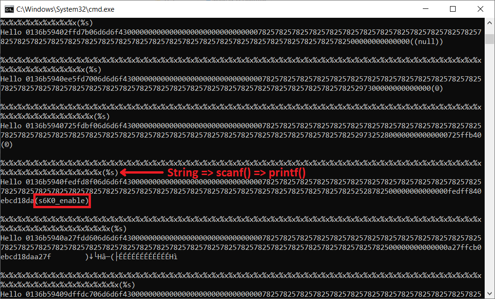

# printf_exploit_for_educationnal_purpose
 
## To test the code
1. **Compile** using `make`
2. **Run** `script.bat`

## Explanations
Using `printf(...)` may come to unsafe behaviour, as it is a variable-argument function.
When you call `printf("%x", intVar);`, the function will print the variable `intVar` in the hexadecimal format.
But if you call `printf("%x");`, the function will still need one variable to print in as an hex. value.
As a consequence, the function will retrieve the first value stored in the stack, and print it (in hexadecimal).
Now, calling `printf("%x%x");` will do the same thing, but with the first and the second values stored in the stack.
Recursivly concatenating a `"%s"` string with `"%x"` will allow you to browse the stack, until you get to the universal password string pointer.

### Source 
[pvs-studio.com/](https://pvs-studio.com/en/blog/posts/cpp/0129/)